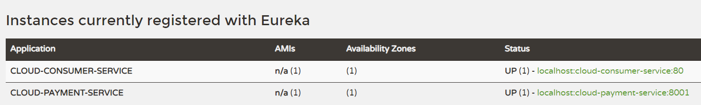
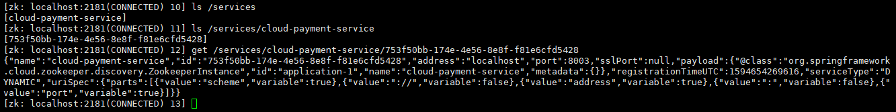
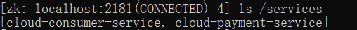
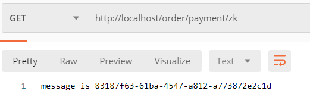
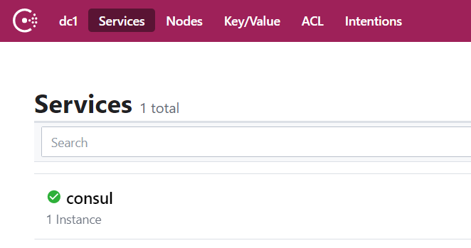
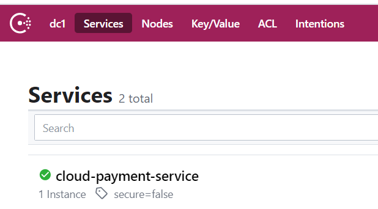
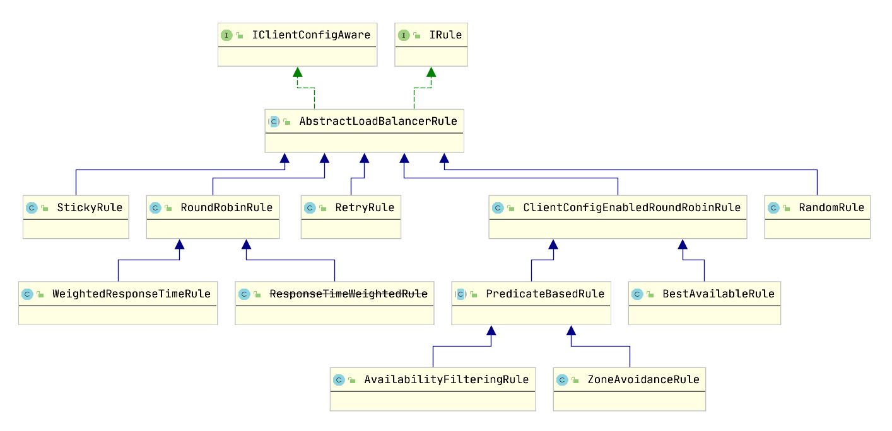

### payment8001

##### 建表语句

```sql
CREATE TABLE `payment` ( 
`id` BIGINT ( 20 ) NOT NULL AUTO_INCREMENT COMMENT 'ID', 
`serial` VARCHAR ( 200 ) DEFAULT '', PRIMARY KEY ( `id` ) 
) ENGINE = INNODB AUTO_INCREMENT = 1 DEFAULT CHARSET = utf8

windows上连接mysql5.5项目启动运行报错serverTimezone则在数据库执行 set global time_zone = '+8:00'; 
```


```xml
当xml文件与Mapper接口文件在同一目录可不配置mybatis.mapper-locations
配置多个mapper位置
ybatis:
  mapper-locations: classpath*:mapper/*.xml,classpath*:com/urthink/upfs/**/*Mapper.xml
```

```java
Payment对象可通过url后的参数获得 或者 通过form表单获得值
@PostMapping("/create")
public CommonResult<Integer> create(Payment payment)

如果通过请求体提交数据则使用@RequestBoay接收对象（前端json请求）
@PostMapping("/create")
    public CommonResult<Integer> create(@RequestBody Payment payment)
```

mybatis
```xml
useGeneratedKeys : 获取数据库自动产生的主键 keyColumn主键对应的数据库列可不指定 keyProperty将主键值映射到入参对象中的属性
接口返回的是受影响的行数（插入成功行数）

int create(Payment payment);
<insert id="create" parameterType="com.guowii.payment.entity.Payment" useGeneratedKeys="true" keyColumn="id" keyProperty="id"  >
    insert into payment (serial) values (#{serial})
</insert>
```


### Order80

1. 参照payment8001工程，在order微服务中使用restTemplate调用payment服务

2. 配置类创建restTemplate

   ```java
   @Configuration
   public class ApplicationContextConfig {
   
       @Bean
       public RestTemplate restTemplate() {
           return new RestTemplate();
       }
   }
   ```

3. OrderController
   使用restTemplate的getForObject、PostForObject进行get/post请求payment接口

   ```java
   @RestController
   @RequestMapping("/consumer")
   public class OrderController {
   
       @Resource
       private RestTemplate restTemplate;
   
       private static final String PAYMENT_URL = "http://localhost:8001/payment";
   
       @GetMapping("/payment/get/{id}")
       public CommonResult<Payment> getPayment(@PathVariable("id") String id) {
           return restTemplate.getForObject(PAYMENT_URL + "/get/" + id, CommonResult.class);
       }
   
       @PostMapping("/payment/create")
       public CommonResult<Integer> create(Payment payment) {
           return restTemplate.postForObject(PAYMENT_URL + "/create",payment,CommonResult.class);
       }
   }
   ```


### Eureka7001注册中心单机版

[Eureka wiki]: https://github.com/Netflix/eureka/wiki


1. pom依赖

   ```xml
   <!--eureka server-->
   <dependency>
     <groupId>org.springframework.cloud</groupId>
     <artifactId>spring-cloud-starter-netflix-eureka-server</artifactId>
   </dependency>
   ```

2. yml配置

   ```yml
   server:
     port: 7001
   
   spring:
     application:
       name: cloud-eureka-server
   
   eureka:
     instance:
       hostname: localhost
       prefer-ip-address: true
     client:
       register-with-eureka: false
       fetch-registry: false
       service-url:
         defaultZone: http://${spring.application.name}:${server.port}/eureka/
   ```

   

3. 主启动类添加`@EnableEurekaServer`

   ```java
   @SpringBootApplication
   @EnableEurekaServer
   public class Eureka7001 {
       public static void main(String[] args) {
           SpringApplication.run(Eureka7001.class,args);
       }
   }
   ```


### payment8001 order80进驻Eureka

1. 启动类增加`@EnableEurekaClient`注解

   ```java
   @SpringBootApplication
   @EnableEurekaClient
   public class Payment8001 {
       public static void main(String[] args) {
           SpringApplication.run(Payment8001.class,args);
       }
   }
   ```

   

2. 修改配置文件application.yml

   ```yml
   eureka:
     client:
       fetch-registry: true
       register-with-eureka: true
       service-url:
         defaultZone: http://localhost:7001/eureka
   ```

3. 一次启动Eureka7001及payment8001 order80微服务
   

### Eureka集群环境搭建

原理：相互注册、互相守望

1. 修改host文件

   ```txt
   127.0.0.1	eureka7001.com
   127.0.0.1	eureka7002.com
   ```

   

2. 修改配置文件

   ```yml
   eureka:
     instance:
       hostname: eureka7001.com
     client:
       register-with-eureka: false
       fetch-registry: true
       service-url:
         defaultZone: http://eureka7002.com:7002/eureka/
   ```

3. payment及order微服务修改注册中心地址

   ```yml
   defaultZone: http://eureka7001.com:7001/eureka/,http://eureka7002.com:7002/eureka/
   ```

### order80通过restTemplate通过微服务名调用payment

1. 配置类中restTemplate添加负载均衡注解@LoadBalanced

   ```java
   @Bean
   @LoadBalanced
   public RestTemplate restTemplate() {
       return new RestTemplate();
   }
   ```

   

2. 将payment服务url替换为微服务名

   ```java
   @RestController
   @RequestMapping("/consumer")
   public class OrderController {
   
       @Resource
       private RestTemplate restTemplate;
   
       //private static final String PAYMENT_URL = "http://localhost:8001";
       private static final String PAYMENT_URL = "http://CLOUD-PAYMENT-SERVICE";
   
   
       @GetMapping("/payment/get/{id}")
       public CommonResult<Payment> getPayment(@PathVariable("id") String id) {
           return restTemplate.getForObject(PAYMENT_URL + "/payment/get/" + id, CommonResult.class);
       }
   
       @PostMapping("/payment/create")
       public CommonResult<Integer> create(Payment payment) {
           return restTemplate.postForObject(PAYMENT_URL + "/payment/create",payment,CommonResult.class);
       }
   }
   ```

### DiscoveryClient服务发现

获取注册中心有哪些微服务及微服务实例的具体信息（uri port ）

1. 注解开启服务发现

   ```
   @SpringBootApplication
   @EnableEurekaClient
   @EnableDiscoveryClient
   public class Payment8001 {
       public static void main(String[] args) {
           SpringApplication.run(Payment8001.class,args);
       }
   }
   
   ```

   

2. 代码中直接注入DiscoveryClient对象

   `discoveryClient.getServices() `获取所有服务ID列表

   `discoveryClient.getInstances(String serviceId)`  获取某一serviceId的实例信息

   ```java
   @Autowired
   private DiscoveryClient discoveryClient;
   
   @GetMapping("/discovery")
       public Object getDiscoveryClient() {
           List<String> services = discoveryClient.getServices();
           for (String service : services) {
               List<ServiceInstance> instances = discoveryClient.getInstances(service);
               log.info("instances--{} :{},url",service,instances);
               for (ServiceInstance instance : instances) {
                   log.info("uri:{}",instance.getUri());
               }
           }
           return services;
       }
   ```

   

### Eureka自我保护机制

当一个微服务不可用时，Eureka不会立刻清理，依旧会对该微服务的信息进行保存

关闭自我保护机制

1. 修改Eureka Server

   ```
   eureka:
     server:
       # 关闭自我保护机制
       enable-self-preservation: false
       # 剔除检测时间
       eviction-interval-timer-in-ms: 2000
   ```

   

2. 修改Eureka Client

   ```
   eureka:
     instance:
       # 服务过期时间 （告诉注册中心超过这个时间没有收到心跳则剔除：默认90s）
       lease-expiration-duration-in-seconds: 1
       # 发送心跳时间 （告诉注册中心我还存活:默认30s）
       lease-renewal-interval-in-seconds: 1
   ```


### 使用Zookeeper替代Eureka注册中心(payment8003)

1. zookeeper快速安装

   ```cmd
   docker run --name zk -d -p 2181:2181 --privileged zookeeper:3.6.0
   
   docker exec -it zk /bin/bash
   cd bin
   ./zkCli.sh
   
   zk命令：
   ls path  查看节点
   get path 获取节点值
   stats path 查看节点状态
   create [-e -s] path val 创建节点（-e 临时节点  -s 顺序节点【自动添加编号】）
   
   ```

2. payment8003进驻 zookeeper

   - pom.xml

     ```xml
     <!--zookeeper-->
     <dependency>
         <groupId>org.springframework.cloud</groupId>
         <artifactId>spring-cloud-starter-zookeeper-discovery</artifactId>
         <exclusions>
             <!--排除自带版本-->
             <exclusion>
                 <groupId>org.apache.zookeeper</groupId>
                 <artifactId>zookeeper</artifactId>
             </exclusion>
         </exclusions>
     </dependency>
     
     <!--使用与zookeeper服务器版本一致客户端-->
     <dependency>
         <groupId>org.apache.zookeeper</groupId>
         <artifactId>zookeeper</artifactId>
         <version>3.4.14</version>
         <exclusions>
             <exclusion>
                 <groupId>org.slf4j</groupId>
                 <artifactId>slf4j-log4j12</artifactId>
             </exclusion>
             <exclusion>
                 <groupId>org.slf4j</groupId>
                 <artifactId>slf4j-api</artifactId>
             </exclusion>
         </exclusions>
     </dependency>
     
     <!----------这个starter中zookeeper是3.5.3-beta 与服务器3.4也能正常匹配，可只引入以下一个starter----------->
     <dependency>
         <groupId>org.springframework.cloud</groupId>
         <artifactId>spring-cloud-starter-zookeeper-discovery</artifactId>
     </dependency>
     ```

   - application.yml

     ```
     server:
       port: 8003
     
     spring:
       application:
         name: cloud-payment-service
       cloud:
         zookeeper:
           connect-string: server.guowii.com:2181
     ```

     

   - 启动类添加`@EnableDiscoveryClient`注解

   - 启动微服务查看zookeeper目录节点

     

   

### cloud-consumerzk-order80调用zookeeper上注册的微服务

   1. pom
   
      ```xml
      <!--zookeeper-->
      <dependency>
          <groupId>org.springframework.cloud</groupId>
          <artifactId>spring-cloud-starter-zookeeper-discovery</artifactId>
      </dependency>
      
      
      <!--web-->
      <dependency>
          <groupId>org.springframework.boot</groupId>
          <artifactId>spring-boot-starter-web</artifactId>
      </dependency>
      
      
      <!--actuator-->
      <dependency>
          <groupId>org.springframework.boot</groupId>
          <artifactId>spring-boot-starter-actuator</artifactId>
      </dependency>
      
      ```

      

   2. yml
   
      ```yml
      server:
        port: 80
      spring:
        application:
          name: cloud-consumer-service
      
        cloud:
          zookeeper:
         connect-string: localhost:2181
      ```

      

   3. 启动类
   
      ```java
      @SpringBootApplication
      @EnableDiscoveryClient
      public class ZkOrder {
          public static void main(String[] args) {
              SpringApplication.run(ZkOrder.class,args);
          }
      }
      ```

      

   4. RestTemplate配置类
   
      ```java
      @Configuration
      public class ApplicationContextConfig {
      
          @Bean
          @LoadBalanced
          public RestTemplate restTemplate() {
              return new RestTemplate();
          }
      }
      ```

      

   5. controller
   
      ```java
      @RestController
      @RequestMapping("/order")
      public class OrderController {
      
          @Resource
          private RestTemplate restTemplate;
      
          private static final String PaymentService = "http://cloud-payment-service";
      
          @GetMapping("/payment/zk")
          public String get() {
              String result =  restTemplate.getForObject(PaymentService + "/payment/zk",String.class);
              return result;
          }
      }
      ```

      
   
   6. 测试 (zookeeper: ls /services)
      
      

### 使用Consul替代Eureka注册中心(payment8004)

1. consul安装使用

   ```
   1 在consul目录执行consul.exe agent -dev
   2 访问localhost:8500
   ```

   

2. pom

   ```xml
   <!--consul注册中心-->
   <dependency>
       <groupId>org.springframework.cloud</groupId>
       <artifactId>spring-cloud-starter-consul-discovery</artifactId>
   </dependency>
   ```

3. yml

   ```yml
   server:
     port: 8004
   spring:
     application:
       name: cloud-payment-service
   
     cloud:
       consul:
         host: localhost
         port: 8500
   ```

   

4. 启动添加`@DiscoveryClient`注解

   


### cloud-consumer-consul-order80调用consul微服务

1. pom

   ```xml
   <dependency>
     <groupId>org.springframework.cloud</groupId>
     <artifactId>spring-cloud-starter-consul-discovery</artifactId>
   </dependency>
   ```

   

2. yml

   ```yml
   server:
     port: 80
   
   spring:
     application:
       name: cloud-order-service
   
     cloud:
       consul:
         host: localhost
         port: 8500
   ```

   

3. 启动类及配置类

   ```java
   1 启动类添加@EnableDiscoveryClient
   2 配置RestTemplate(@Bean @LoadBalanced )
   3 controller层
   
   @RestController
   @RequestMapping("/order")
   public class ConsulOrderController {
       @Resource
       private RestTemplate restTemplate;
   
       private static final String PAYMENT_SERVICE = "http://cloud-payment-service";
   
       @GetMapping("/payment/consul")
       public String getFromConsul() {
           return restTemplate.getForObject(PAYMENT_SERVICE + "/payment/consul",String.class);
       }
   }
   ```

### Ribbon实现服务负载均衡

#### 负载均衡（Load Balance）

概念：将用户请求平摊的分配到多个服务上，达到系统的高可用（HA）,常见的负载均衡有软件Nginx LVS 硬件F5等

##### 集中式负载均衡

​	在服务的提供方和服务的消费方提供独立的LB设施（F5、Nginx) , 由LB设施负责将用户请求按照某种策略转发到服务的提供方

##### 进程内负载均衡

​	将LB逻辑集成到服务消费方（Ribbon），消费方从服务注册中心获取哪些地址可用，然后自己从服务地址中挑选一个合适的服务器


#### Ribbon核心组件IRule

IRule:根据特定算法从服务列表中选取一个要访问的服务



#### cloud-consumer-order80自定义负载均衡策略

Ribbon默认使用RoundRobin轮询算法

1. 配置自定义规则类:在非@ComponentScan扫描包及子包下面建立配置类

   ```java
   package com.guowii.custom;
   
   @Configuration
   public class CustomRule {
   
       // 自定义负载均衡路由规则
       @Bean
       public IRule getRule() {
           return new RandomRule();
       }
   }
   ```

2. 在启动类上配置服务与负载均衡策略关系`@RibbonClient`

   ```java
   package com.guowii.order;
   
   import com.guowii.custom.CustomRule;
   import org.springframework.boot.SpringApplication;
   import org.springframework.boot.autoconfigure.SpringBootApplication;
   import org.springframework.cloud.netflix.eureka.EnableEurekaClient;
   import org.springframework.cloud.netflix.ribbon.RibbonClient;
   
   @SpringBootApplication
   @EnableEurekaClient
   @RibbonClient(name = "cloud-payment-service",configuration = CustomRule.class)
   public class Order80 {
   
       public static void main(String[] args) {
           SpringApplication.run(Order80.class,args);
       }
   }
   ```

   

3. RestTemplate配置负载均衡及使用服务名调用payment

#### 自定义负载均衡算法

```java
通过AtomicInteger原子整型类保存访问次数，atomicInteger.getAndIncrement自增访问次数保证线程安全，底层原理为CAS
---------------------order80-orderController---------------------------------    
    private final static AtomicInteger atomicInteger = new AtomicInteger(0);

    @Resource
    private DiscoveryClient discoveryClient;
    
    @GetMapping("/lb")
    public CommonResult<Payment> getLbPayment() {
        String serviceId = "cloud-payment-service";
        // 访问次数每次+1，actomicInteger保证线程安全
        int visitCount = atomicInteger.getAndIncrement();
        // 获取所有服务实例
        List<ServiceInstance> instanceList = discoveryClient.getInstances(serviceId);
        // 轮询算法 本次访问服务 = 访问次数 % 服务数
        int index = visitCount % instanceList.size();
        ServiceInstance serviceInstance = instanceList.get(index);
        URI uri = serviceInstance.getUri();
        // 通过RestTemplate根据uri调用服务
        ResponseEntity<CommonResult> responseEntity = restTemplate.getForEntity(uri + "/payment/get/1", CommonResult.class);
        if (responseEntity != null && responseEntity.getStatusCode().is2xxSuccessful()) {
            return responseEntity.getBody();
        } else {
            return new CommonResult<>();
        }
    }


--------------------配置类不加@LoadBalanced注解----------------------------------
    @Bean
    //@LoadBalanced
    public RestTemplate restTemplate() {
        return new RestTemplate();
    }
```


### openFeign调用微服务

Feign是一个声明式的Web服务客户端,让编写Web服务客户端变得非常容易,只需  创建一个接口并在接口上添加注解即可

1. pom

   ```xml
   <!--openFeign-->
   <dependency>
       <groupId>org.springframework.cloud</groupId>
       <artifactId>spring-cloud-starter-openfeign</artifactId>
   </dependency>
   ```

2. yml

   ```yml
   server:
     port: 80
   
   
   eureka:
     client:
       fetch-registry: true
       register-with-eureka: false
       service-url:
         #defaultZone: http://localhost:7001/eureka/
         # 集群版配置
         defaultZone: http://eureka7001.com:7001/eureka/,http://eureka7002.com:7002/eureka/
   ```

3. 启动类（使用`@EnableFeignClients`）

   ```java
   @SpringBootApplication
   @EnableFeignClients
   public class FeignOrder80 {
       public static void main(String[] args) {
           SpringApplication.run(FeignOrder80.class);
       }
   }
   ```

   

4. 超时配置（消费侧愿意等待的时间）

   ```yml
   ribbon:
     ReadTimeout: 10000
     ConnectTimeout: 3000
     
   # 使用如下配置也行
   feign:
     client:
       config:
         default:
           connectTimeout: 15000
           readTimeout: 3000
           loggerLevel: basic
     
   ```

   

5. feign调用日志配置(feignClient日志级别需要配置为debug才会输出feign日志)

   + 配置feignClient日志级别
   + 配置feign日志级别

   ```yml
   # 配置feignClient日志打印级别为debug
   logging:
     level:
       com.guowii.consumer.service.PaymentFeignClient: debug
   ```

   ```java
   /*
    * NONE, No logging (DEFAULT).
    * BASIC, Log only the request method and URL and the response status code and execution time.
    * HEADERS, Log the basic information along with request and response headers.
    * FULL, Log the headers, body, and metadata for both requests and responses.
   */
   @Configuration
   public class FeignClientConfig {
   
       @Bean
       public Logger.Level feignLoggerLevel() {
           return Logger.Level.FULL;
       }
   }
   ```

   

6. feignClient接口(`@FeignClient`)

   ```
   
   @FeignClient("cloud-payment-service")
   @Service
   @RequestMapping("/payment")
   public interface PaymentFeignClient {
   
       // pathVariable必须配置value否则会启动报错
       @GetMapping("/get/{id}")
       public CommonResult<Payment> getPaymentById(@PathVariable("id") String id);
   
       @PostMapping("/create")
       public CommonResult<Integer> create(@RequestBody Payment payment);
   }
   ```

   

7. controller直接注入feignClient接口调用cloud-payment-service微服务

   ```java
   @RequestMapping("/consumer")
   @RestController
   public class OrderController {
   
       @Autowired
       private PaymentFeignClient paymentFeignClient;
   
       @GetMapping("/feign/payment/get/{id}")
       public CommonResult<Payment> getPaymentById(@PathVariable String id) {
           return paymentFeignClient.getPaymentById(id);
       }
   
       @PostMapping("/feign/payment/create")
       public CommonResult<Integer> create(@RequestBody Payment payment) {
           return paymentFeignClient.create(payment);
       }
   }
   ```

   


